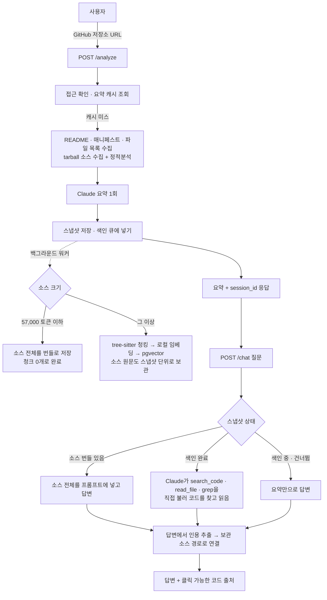

# RepoDive

RepoDive는 GitHub 저장소 주소를 넣으면 코드를 읽어 구조와 기술 스택을 요약하고, 이어서 그 코드에 대해
질문할 수 있는 서비스입니다. 답변은 "어느 파일 몇 행"인지 인용을 달고 나오고, 화면에서 그 인용을 누르면
실제 코드가 펼쳐집니다.

풀고 싶었던 문제는 두 가지였습니다. 남의 저장소를 처음 열었을 때 어디부터 봐야 할지 모르는 상태를
줄이는 것, 그리고 LLM이 코드에 대해 답할 때 근거 없이 그럴듯하게 말하는 것을 막는 것입니다. 그래서
요약보다 "질문에 답하면서 근거를 짚는 것"에 더 많은 시간을 썼습니다. 한국어로 물으면 코드를 못 찾는 문제,
검색 결과를 미리 넣는 방식과 모델이 직접 도구를 부르는 방식 중 어느 쪽이 나은지, 답변의 행 번호가 실제로
얼마나 맞는지 같은 질문은 감으로 정하지 않고 평가셋을 먼저 만들어 재서 정했습니다.

https://github.com/user-attachments/assets/a282ab39-936b-4a08-ab53-7da88dbe3ffa

*로그인하지 않은 상태에서 막히는 것부터 GitHub 로그인, 저장소 목록, 분석, 질문과 근거 인용까지 한 번에
담았습니다. 1분 51초, 무음.*


*`jjunyuongv/air`에 "실시간 채팅 기능들의 각각 파일들을 보여줘"라고 물은 결과. 행 표기마다 링크가 걸려 있습니다.*


*근거 목록에서 `ChatHandler.java 24행`을 펼친 것. 인용한 행을 하이라이트하고 앞뒤로 20행씩 붙여 보여줍니다.
서버는 인용이 맞았는지 판정하지 않습니다. 코드를 그대로 펼쳐 두고 맞았는지는 사람이 봅니다.*

## 주요 기능

- **저장소 요약.** README, 매니페스트, 파일 목록을 모아 Claude에게 넘겨 프로젝트 개요, 기술 스택, 디렉터리
  구조를 한국어로 정리합니다. 설정 파일을 읽지 않는 린터(ruff, oxlint, PMD, stylelint)를 함께 돌려 코드
  상태 집계도 넣습니다.
- **저장소 크기에 따라 두 방식으로 답합니다.** 소스가 57,000 토큰 이하인 저장소는 소스 전체를 프롬프트에
  넣고, 그보다 크면 Claude가 `search_code`, `read_file`, `grep` 도구를 직접 불러 필요한 코드를 찾아 읽습니다.
  어느 쪽이 나은지는 같은 실행에서 나란히 재서 정했습니다.
- **코드 검색.** 소스를 tree-sitter로 함수·클래스 단위로 잘라 로컬 임베딩 모델로 벡터화하고 pgvector에
  저장합니다. 임베딩은 로컬 ONNX라 API 과금이 없습니다.
- **파일과 행 번호 인용.** 답변의 `ChatHandler.java 24행` 같은 표기를 뽑아 보관해 둔 소스의 실제 경로로
  연결하고, 클릭하면 그 범위의 코드를 펼칩니다.
- **근거 없는 답을 막는 장치.** 근거가 없으면 정해진 문구로 거절하도록 프롬프트에 못 박고, 저장소에 없는
  기능을 묻는 질의 18개로 실제로 거절하는지 별도 축으로 잽니다.
- **평가 하네스.** 검색 정확도, 인용 정확도, 거절 정확도, 행 번호 정확도, 질문당 비용을 `pytest -m evaluation`
  으로 재고 기록을 남깁니다. 검색과 행 번호 평가는 LLM을 부르지 않아 무과금입니다.

## 동작 방식



`/analyze`는 요약을 돌려주기 직전에 코드 색인을 백그라운드 큐에 넣고 기다리지 않습니다. 요약 캐시 키는
저장소의 `pushed_at`이라 push가 없으면 다시 분석해도 LLM을 부르지 않습니다. 대화의 캐시 브레이크포인트는
system과 첫 사용자 메시지 둘이고, 도구 왕복은 그 뒤에 쌓여 접두사가 깨지지 않습니다. 검색 결과를 질문에
미리 넣지 않는 이유가 여기 있습니다. 그 자리는 캐시 뒤라 왕복마다 다시 청구됩니다.

요청 순서, 색인 흐름, 인용 처리, 캐시와 데이터 저장, 설계 판단과 제한사항은
[docs/architecture.md](docs/architecture.md)에 있습니다.

## 핵심 성과

평가셋은 Java 웹앱(`jjunyuongv/air`), Python/JS 웹앱(`jjunyuongv/marryday`), 작은 Java 라이브러리
(`teaey/apns4j`) 세 저장소에 정답 질의 49개와 거절 질의 18개입니다. 정답은 청크 id가 아니라
`(파일 접미사 + 포함 문자열)`로 적어 청킹 규칙이 바뀌어도 무효가 되지 않습니다.

| 무엇 | 전 | 후 | 조건 |
|---|---|---|---|
| 한국어 질의 Recall@8 | 0.17 | 0.67 | 임베딩 모델 jina-code → multilingual-e5-large (air, 12개) |
| 한국어 질의 Recall@8 | 0.67 | 0.75 | e5-large fp32 → int8 양자화. 속도 2.52배, 세 저장소 모두 동률 이상 |
| 영문 식별자 Recall@8 | 0.80 | 1.00 | 청킹 수정 (클래스 헤더 손실 복구, 800자 재분할, 저정보 감점) |
| 인용 정확도 (큰 저장소) | 0.7647 | 1.0 | 검색 결과 사전 주입 → tool use. 비용 1.76배 (상한 3.0배) |
| 인용 정확도 (작은 저장소) | 1.0 | 0.9375 | 전체 주입 → tool use. 떨어져서 작은 저장소에는 도구를 켜지 않음 |
| 인용 추출 / 유실 | 535 / 358 | 814 / 79 | 인용 파서 수정. 새로 생긴 잘못된 링크 0건 |
| 행 번호 정확도 | 50% | 71.1% | 프롬프트 수정 + 파서 수정. 서버는 이 값을 고쳐 주지 않고 그대로 보여줌 |

tool use 판정은 측정 전에 기준을 정해 두고(인용 정확도가 떨어지면 기각, 비용이 3배를 넘으면 큰 저장소
전용) 156 호출, 실비 $2.1259로 잰 결과입니다. 판정을 실제로 받친 것은 큰 Java 웹앱 한 세트이고, 다른 큰
저장소의 개선폭 +0.0625는 한 건이라 노이즈와 구분되지 않아 근거로 세지 않았습니다. 평가 방법, 세트별 전체
결과 표, 거절 채점기가 샌 경위와 한계는 [docs/evaluation.md](docs/evaluation.md)에 있습니다.

## 기술 스택

**Backend**
- FastAPI, uvicorn — API 서버. `/analyze`, `/chat`, `/auth`, `/health`, `/admin`
- httpx — GitHub REST API 호출과 tarball 다운로드
- psycopg 3 + pgvector — PostgreSQL 접속과 벡터 검색
- tree-sitter — 함수·클래스 단위 청킹 (39개 확장자)
- fastembed (onnxruntime) — 로컬 임베딩. torch 없이 돕니다
- ruff, oxlint, PMD, stylelint — 요약에 넣는 정적분석. 설정 파일과 의존성을 읽지 않는 도구만 골랐습니다

**Frontend**
- React 19, TypeScript, Vite — 화면
- react-markdown — 답변 렌더링. 인용 링크는 rehype 플러그인으로 삽입

**AI**
- Claude API (`anthropic` SDK) — 요약과 질문 답변. 기본 모델 `claude-sonnet-5`
- Prompt caching, Tool use, 토큰 계산 API — 캐시 접두사 설계, `search_code`·`read_file`·`grep`, 전체 주입 판정
- multilingual-e5-large (int8 ONNX) — 코드와 질문 임베딩. 로컬 실행

**Database**
- PostgreSQL 17 + pgvector — 저장소, 스냅샷, 대화, 코드 청크와 임베딩(HNSW), 보관 소스, 실행 기록

**Infrastructure**
- Docker Compose — 운영은 nginx, backend, db 셋. 개발은 db 하나
- nginx — 정적 파일과 API 프록시. 인증이 없는 `/admin`은 프록시하지 않습니다
- GitHub OAuth — 로그인. 신원 확인만 하고 토큰은 저장하지 않습니다. 기본은 꺼짐

## 프로젝트 구조

```
RepoDive/
├─ Back/
│  ├─ app/
│  │  ├─ main.py                  FastAPI 인스턴스, 라우터 등록
│  │  ├─ config.py                환경변수 로딩
│  │  ├─ api/                     analyze · chat · auth · admin · health 라우터
│  │  ├─ services/
│  │  │  ├─ claude_client.py      Claude 호출, 도구 루프, 프롬프트, 비용 계산
│  │  │  ├─ tools.py              search_code · read_file · grep 정의와 실행기
│  │  │  ├─ citations.py          답변에서 인용을 뽑는 유일한 파서
│  │  │  ├─ indexer.py            색인 빌드, 전체 주입 판정, 코드 검색
│  │  │  ├─ github_client.py      GitHub API, tarball 수집
│  │  │  └─ static_analysis.py    린터 실행과 집계
│  │  ├─ core/                    chunker (tree-sitter) · embeddings (ONNX) · chunk_rule (규칙 해시)
│  │  ├─ db/                      테이블별 접근 함수, schema.sql
│  │  └─ templates/               관리자 페이지
│  ├─ tests/
│  │  ├─ search_eval_dataset.py   평가셋 (정답 질의 · 거절 질의)
│  │  ├─ test_search_quality.py   검색 품질 측정
│  │  ├─ test_citation_quality.py 인용 · 거절 · 비용 측정 (과금)
│  │  ├─ test_line_accuracy.py    행 번호 정확도
│  │  └─ test_*.py                단위 · DB 통합 테스트
│  ├─ .env.example
│  ├─ Dockerfile                  임베딩 모델을 빌드 시점에 굽습니다
│  └─ docker-compose.yml          개발용 DB 하나
├─ Front/
│  ├─ src/                        App · Chat · citations (rehype 플러그인) · Repos · api
│  ├─ nginx.conf
│  └─ Dockerfile
├─ docs/
│  ├─ architecture.md             동작 방식, 설계 판단, 제한사항
│  ├─ evaluation.md               평가셋, 지표, 결과 표, 한계
│  └─ img/
└─ docker-compose.prod.yml        운영 스택 (nginx · backend · db)
```

## 실행 방법

Python 3.12 이상, Node 22, Docker가 필요합니다.

**1. 환경변수**

```bash
cp Back/.env.example Back/.env
```

`ANTHROPIC_API_KEY`만 필수입니다. `GITHUB_TOKEN`은 없어도 되지만 없으면 GitHub API 한도가 시간당 60회입니다.
나머지는 기본값으로 돌고, 각 항목의 뜻은 `.env.example`의 주석에 있습니다.

**2. Backend**

```bash
docker compose -f Back/docker-compose.yml up -d      # PostgreSQL + pgvector

cd Back
pip install -r requirements.txt
npm install                     # 선택. oxlint · stylelint
python scripts/install_pmd.py   # 선택. PMD. JRE 17 필요
uvicorn app.main:app --reload
```

첫 기동 때 임베딩 모델(수백 MB)을 내려받습니다. 테이블은 기동할 때 자동으로 만듭니다. 린터는 하나도 없어도
서비스는 돕니다.

**3. Frontend**

```bash
cd Front
npm install
npm run dev
```

http://localhost:5173 에서 열립니다. Vite 개발 서버가 API 경로를 백엔드(8000)로 프록시합니다.

**Docker로 한 번에 띄우기**

```bash
cp .env.prod.example .env.prod   # ANTHROPIC_API_KEY, POSTGRES_PASSWORD 를 채운다
docker compose --env-file .env.prod -f docker-compose.prod.yml up -d --build --force-recreate
```

http://localhost 에서 열립니다. `--force-recreate`는 빼면 안 됩니다. `--build`만 하면 옛 컨테이너가 계속 돌 수
있고, 그때 빌드 로그와 healthcheck가 둘 다 정상이라 알아챌 신호가 없습니다.

**테스트**

```bash
cd Back
pytest -q                                                              # 440 passed · 153 skipped (Postgres 없이 실행. DB 통합·측정 테스트는 skip)
pytest -m evaluation tests/test_search_quality.py -s                   # 검색 품질 측정 (무과금)
pytest -m "billed and evaluation" tests/test_citation_quality.py -s    # 인용 · 거절 · 비용 (과금)
```

## 문서

- [docs/architecture.md](docs/architecture.md) — 요청 흐름, 저장소 크기에 따른 분리, 코드 검색, 인용 처리,
  캐시와 데이터, 설계 판단, 제한사항
- [docs/evaluation.md](docs/evaluation.md) — 평가셋, 기준, 검색·인용·거절·행 번호 정확도 결과, 한계
